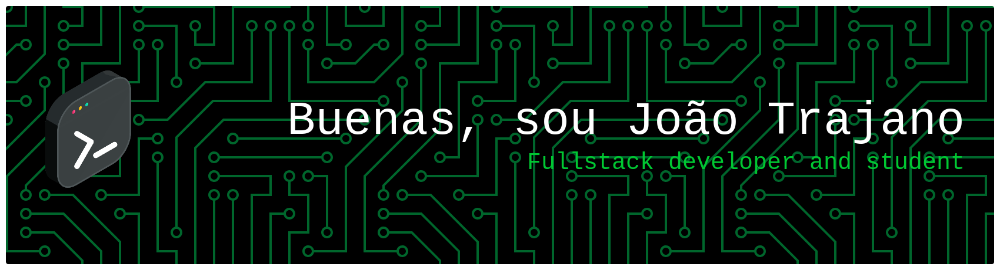

<h1 align="center">Obrigado por visitar meu perfil!</h1>

###

  
  
  
  
  
  
  
  
  
  
  
  
  
  
  
  

###

 

  

  <h2 align="center">Sou um desenvolvedor full stack que estudou por três anos na Unisinos e, atualmente, faz análise e desenvolvimento de sistemas no IFRS.</h2>

###

  <h2> Redes Sociais </h2>
  
  
  

 

  

###

  <h2> Estatísticas 📈</h2>
  
  

###

  <h2> Músicas ouvidas Recentemente 🎵 </h2>
  

 

  

###

  

###
